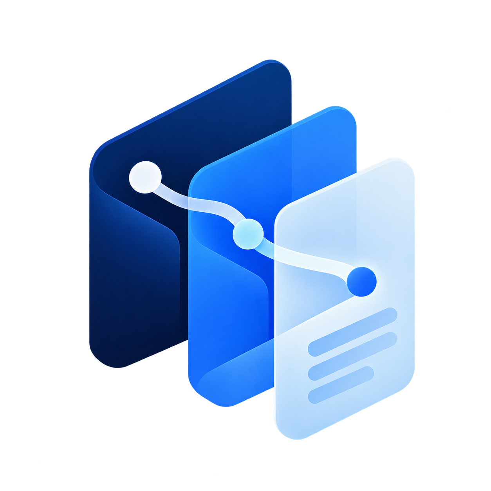

<p align="center">
  
</p>

<h1 align="center">Provenance AI</h1>

<p align="center">
  Open-source, multi-tenant RAG platform for AI assistants that answer from evidence you can trace.
</p>

<p align="center">
  <a href="LICENSE"></a>
  
  
  
</p>

## What is Provenance?

Provenance is an open-source knowledge platform for specialized AI assistants over private documents, curated knowledge packs, and optionally the live web. Its core principle is simple: important answers should be inspectable back to their sources.

Every workspace receives six ready-to-use built-in assistants:

- Document Analyst
- Health Information Assistant
- Legal Research Assistant
- Portfolio Manager Assistant (allocation, exposure and diversification only; no price forecasts, options calls or market timing)
- Study Assistant
- Tax & Accounting Assistant

The built-ins are preconfigured but not locked down: users can rename them, add instructions, change jurisdiction/location settings and control web access. Provenance keeps the underlying specialist behavior and safety policy as the default layer. **Custom Assistant** is the only assistant type that requires creation/configuration before first use.

Each assistant has a private upload knowledge base. Curated public packs are stored once and linked to applicable assistants instead of being duplicated per user. Location-aware assistants can attach maintained jurisdiction packs from the user's saved setting or an initial coarse deployment-region hint; users can always override that location in assistant settings.

## Zero-cost reference deployment

The default deployment path is deliberately designed to avoid billable infrastructure:

- Supabase Free for Postgres, Auth, pgvector and private Storage
- Vercel Hobby for the Next.js web app
- GitHub Actions standard runners on this public repository for batched ingestion and source refresh
- Cloudflare Workers AI Free for generation and multilingual BGE-M3 embeddings
- ClamAV in a GitHub Actions service container for fail-closed malware scanning

Cloudflare Workers AI's Free plan provides a daily no-charge allocation; when that allocation is exhausted, requests fail instead of automatically billing. Cloudflare also states that Workers AI Customer Content is not used to train AI models or improve Cloudflare or third-party services without explicit consent. Review the provider's current terms before production use.

Paid AI providers are disabled by default. `ALLOW_BILLABLE_AI` must be explicitly set to `true` before the web app may use an AI Gateway or direct OpenAI fallback.

The free worker is intentionally batch-oriented rather than always-on. New uploads can wait for the next scheduled GitHub Actions run instead of being indexed instantly.

## Highlights

### Web application

- Next.js App Router + TypeScript + Tailwind
- Supabase SSR authentication and session refresh
- RLS-protected multi-tenant schema
- Six auto-provisioned, editable built-in assistants plus user-created Custom assistants
- Coarse location-derived jurisdiction initialization with saved/user-edited settings taking precedence
- Private signed document uploads with live status, retry and deletion
- Streaming AI chat with markdown rendering
- Hybrid pgvector + PostgreSQL FTS retrieval using Reciprocal Rank Fusion
- HNSW vector index
- Effective-date and current-source filtering
- Clickable RAG citations with source inspection
- Optional web search per turn
- Persistent conversation history
- Daily usage quota reservation
- Signup confirmation, login/logout and password recovery

### Document ingestion worker

- Python + Docling structural document processing
- Page, heading and table provenance retention
- Cloudflare-hosted BGE-M3 multilingual embeddings at 1024 dimensions
- `FOR UPDATE SKIP LOCKED` job claiming
- One-shot mode for scheduled GitHub Actions execution
- Retry and stale-lock recovery
- SHA-256 content hashing and immutable document versions
- Curated-source refresh with redirect-aware SSRF controls and bounded downloads
- Fail-closed ClamAV support
- Shared curated and jurisdiction-pack manifest importer
- Scheduled manifest registration so known packs remain available and refreshable

### Portfolio Manager

The portfolio module deterministically calculates portfolio structure before the LLM explains it:

- security weights
- largest / top-3 / top-5 concentration
- HHI concentration
- effective number of holdings (`1 / HHI`)
- sector and industry exposure
- asset-class exposure
- geographic exposure
- currency exposure
- account exposure
- duplicate-security aggregation across accounts
- concentration and data-quality flags

The assistant policy blocks price targets, expected-return forecasts, security predictions, options strategies, leverage calls and market timing.

## Architecture

```text
Browser / Next.js
       │
       ▼
RAG orchestrator ───── optional web search
       │
       ├── PostgreSQL full-text search
       ├── pgvector semantic search
       └── metadata / jurisdiction filters
       │
       ▼
Cloudflare Workers AI + citations

Uploads → private Supabase Storage → ingestion queue
                                      │
                                      ▼
                       scheduled GitHub Actions worker
                                      │
                    Docling + ClamAV + Workers AI
                                      │
                                      ▼
                              chunks + embeddings
```

A bot is configuration, not a separate service: preset behavior + user instructions + attached knowledge bases + tools + jurisdiction + retrieval/model policy. See [`docs/ARCHITECTURE.md`](docs/ARCHITECTURE.md).

## Repository layout

```text
.
├── apps/
│   ├── web/                 # Next.js application
│   └── worker/              # Docling/embedding ingestion worker
├── supabase/
│   ├── migrations/          # schema, RLS, storage, retrieval RPCs
│   └── tests/
├── knowledge/manifests/     # curated knowledge-pack manifests
├── evals/                   # RAG / safety evaluation fixtures
├── docs/                    # architecture, security, deployment and eval docs
└── .github/workflows/       # CI + free scheduled ingestion
```

## Quick start

### 1. Create a Supabase project

Create a fresh Supabase project and apply every SQL file in `supabase/migrations` in lexical order. Do not reuse an unrelated production database. The migrations provision the six built-in assistants for each workspace automatically.

### 2. Configure the free AI provider

Create a Workers AI API token and copy your Cloudflare Account ID. The defaults are:

```text
CLOUDFLARE_ACCOUNT_ID=
CLOUDFLARE_API_TOKEN=
CLOUDFLARE_AI_MODEL=@cf/zai-org/glm-4.7-flash
CLOUDFLARE_EMBEDDING_MODEL=@cf/baai/bge-m3
EMBEDDING_DIMENSIONS=1024
ALLOW_BILLABLE_AI=false
```

Copy `.env.example` for the complete environment contract. Never commit populated secrets.

### 3. Start the web app

```bash
cd apps/web
npm install
npm run dev
```

### 4. Run ingestion locally

```bash
cd apps/worker
python -m venv .venv
. .venv/bin/activate
pip install . --extra-index-url https://download.pytorch.org/whl/cpu
grounded-worker
```

For the hosted zero-cost path, configure the repository secrets documented in [`docs/DEPLOYMENT.md`](docs/DEPLOYMENT.md); `.github/workflows/free-worker.yml` then registers known manifests, refreshes due sources and processes queued documents every 15 minutes.

### 5. Smoke test

1. Create and confirm an account.
2. Open the already-provisioned Document Analyst.
3. Upload a PDF and wait for status `ready`.
4. Ask a question that requires the PDF.
5. Open a citation and verify its page/section text.
6. Open Legal / Tax & Accounting and verify the configured jurisdiction in assistant settings.
7. Create a second test user and verify tenant isolation.
8. Import a portfolio CSV and use the already-provisioned Portfolio Manager assistant.
9. Create a Custom Assistant and verify it remains isolated from the built-ins.

## Professional knowledge packs

The repository contains maintained pack definitions and source registries without claiming exhaustive legal, tax or clinical coverage. India legal/tax starter packs register official Government of India sources. The health baseline includes a global WHO pack plus an India-specific public-health/guideline pack. Registered packs are refreshed and versioned by the source pipeline.

Jurisdiction packs are intentionally curated and cached rather than blindly mirroring every law, tax page and clinical document worldwide. Operators can add country/region manifests from authoritative sources; once registered, a pack is retained/versioned and automatically attached to matching location-aware assistants. This avoids silently serving stale or unlicensed material while remaining compatible with the free reference deployment.

Production operators remain responsible for source licensing/redistribution review, freshness, domain-specific evaluation and professional-assistant disclosures.

## Security

The LLM does not decide authorization. Access is enforced by PostgreSQL Row Level Security and private Storage policies. Retrieved documents and web content are treated as untrusted evidence, so prompt injection in a document cannot grant database permissions.

Uploaded/source documents can be scanned fail-closed through ClamAV before parsing. The zero-cost hosted workflow provides ClamAV as an isolated Actions service container.

Please read [`docs/SECURITY.md`](docs/SECURITY.md). To report a vulnerability, follow [`.github/SECURITY.md`](.github/SECURITY.md).

## Deployment

The zero-cost reference split is:

- `apps/web` → Vercel Hobby
- Supabase Free → Postgres / Auth / Storage / pgvector
- `.github/workflows/free-worker.yml` → scheduled ingestion, manifest registration and source refresh
- Cloudflare Workers AI Free → generation and embeddings

No Render resource is required by the default deployment.
